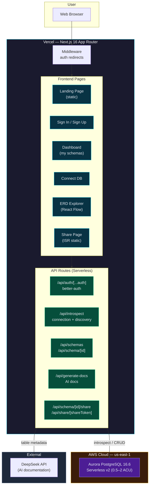

# SchemaLens

> Interactive PostgreSQL schema explorer with AI-generated documentation.

Connect your PostgreSQL database and get an instant, interactive entity-relationship diagram with AI-generated documentation — no setup required.

**Built for [H0: Hack the Zero Stack](https://h0.hackathon.com) (Track 4: Open Innovation)**

---

## Architecture



### Data Flow

1. **Connect** — User pastes a PostgreSQL connection string → server-side introspection queries the system catalog → tables, columns, foreign keys returned as JSON
2. **Explore** — React Flow renders an interactive ERD canvas with table nodes and FK edges → click for column details
3. **Document** — One-click AI generation sends table metadata to DeepSeek → natural language docs per table
4. **Share** — Generates a unique token → schema rendered as ISR static page → shareable without auth

---

## Tech Stack

| Layer | Technology |
|-------|-----------|
| Frontend | Next.js 16 (App Router), React 19, Tailwind CSS v4, shadcn/ui |
| ERD Canvas | React Flow |
| Auth | better-auth (email/password, httpOnly cookies) |
| ORM | Drizzle ORM |
| Database | Amazon Aurora PostgreSQL 16.6 (Serverless v2) |
| AI | DeepSeek API (deepseek-v4-flash) |
| Hosting | Vercel (Edge + Serverless Functions) |

---

## Getting Started

### Prerequisites

- Node.js 20+
- PostgreSQL database (local or remote)

### Setup

```bash
# Clone
git clone https://github.com/faizalmy/schemalens.git
cd schemalens

# Install dependencies
pnpm install

# Environment variables
cp .env.local.example .env.local
# Edit .env.local with your DATABASE_URL, LLM_API_KEY, etc.

# Push Drizzle schema
npx drizzle-kit push

# Start dev server
pnpm dev
```

### Environment Variables

| Variable | Description |
|----------|-------------|
| `DATABASE_URL` | PostgreSQL connection string |
| `BETTER_AUTH_SECRET` | Auth encryption key (`openssl rand -base64 32`) |
| `BETTER_AUTH_URL` | App URL (e.g. `http://localhost:3000`) |
| `LLM_API_KEY` | API key for AI documentation |
| `LLM_BASE_URL` | LLM provider base URL |
| `LLM_MODEL` | Model identifier |
| `NEXT_PUBLIC_APP_URL` | Public app URL for share links |

---

## Features

- **Instant ERD** — Introspect any PostgreSQL schema and render an interactive entity-relationship diagram
- **Relationship Mapping** — Auto-detect foreign key relationships with directional edges
- **AI Documentation** — Generate per-table documentation with one click
- **Secure Connections** — Credentials used only at connection time, never stored
- **Shareable Links** — Token-gated read-only share pages via ISR
- **Multi-schema Support** — Connect multiple databases, switch between snapshots

---

## Live Demo

**https://schemalens-khaki.vercel.app**

---

## Submission

- **Vercel Team:** faizalmys-projects
- **Vercel Project:** schemalens
- **Aurora Region:** us-east-1
- **Aurora Engine:** Aurora PostgreSQL 16.6 Serverless v2 (0.5–2 ACU)
- **AI Provider:** DeepSeek (model: deepseek-v4-flash)

Built for H0: Hack the Zero Stack · Track 4: Open Innovation
