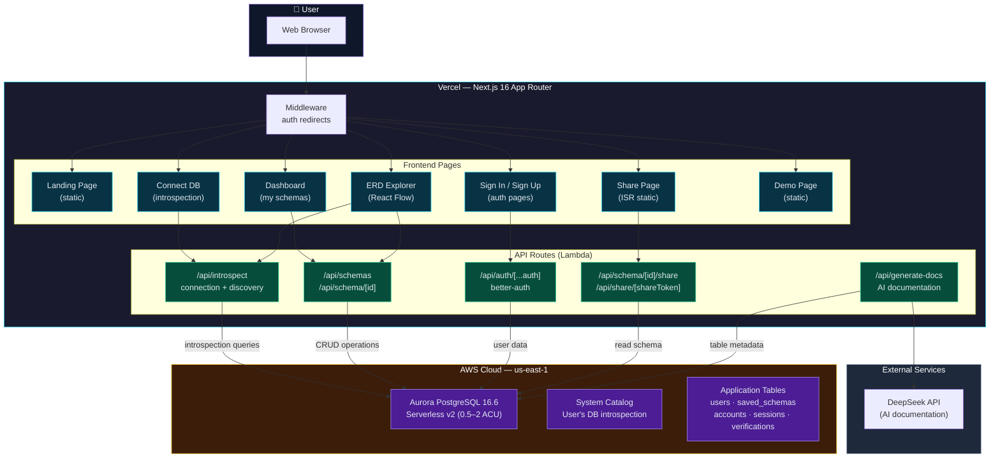

# SchemaLens Architecture Diagram

## Data Flow

1. **Landing / Auth** → Static pages render fast, no DB needed
2. **Connect DB** → User pastes PostgreSQL connection string → server-side introspection queries Aurora system catalog → table/column/FK data returned as JSON
3. **ERD Explorer** → React Flow canvas renders tables as nodes, foreign keys as edges → click table for column details
4. **AI Docs** → Table metadata sent to DeepSeek API → natural language documentation generated → stored in Aurora
5. **Share** → Generates unique token → schema rendered as ISR static page → publicly accessible without auth
